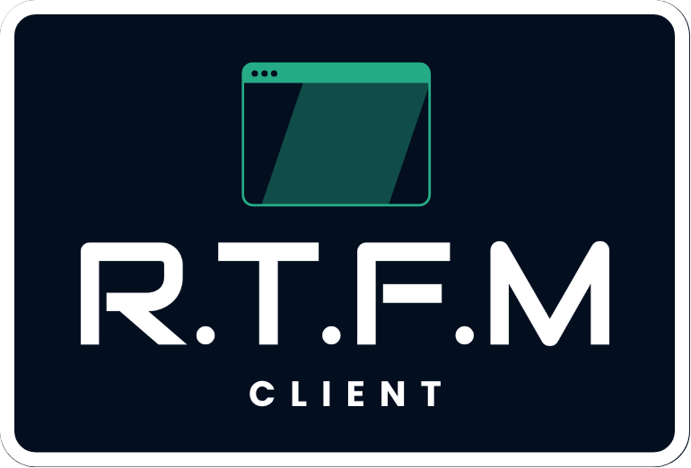
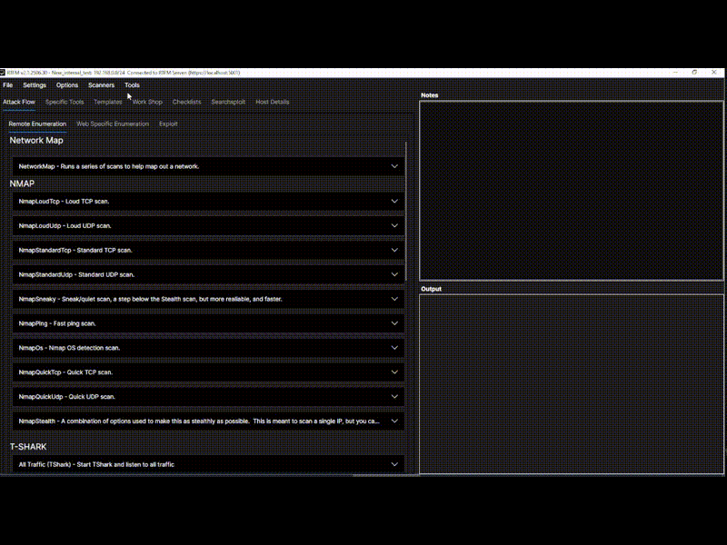
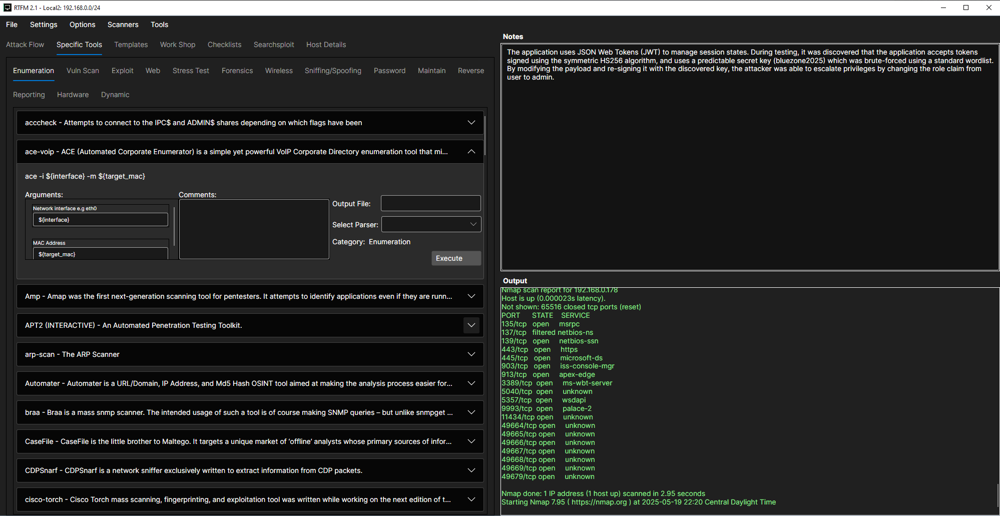
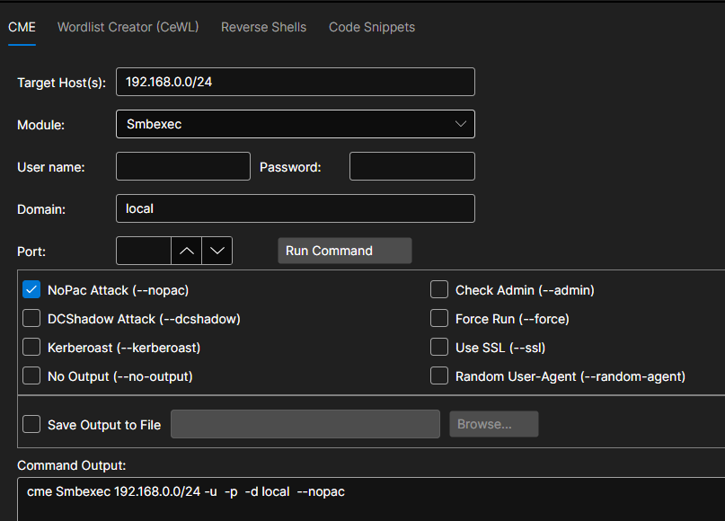
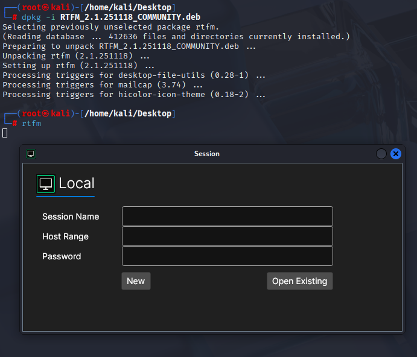
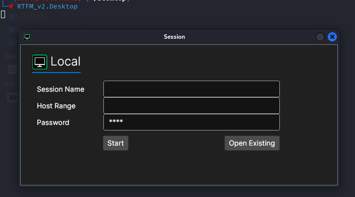

## 🔍 **RTFM Client – Penetration Testing, Streamlined**

* https://www.youtube.com/@GreyProtocolSecurity
* https://www.greyprotocolsecurity.com/



**Download**: https://github.com/rtfmplatform/RTFMv2-Community/releases



**RTFM Client** is a powerful, cross-platform desktop application designed for professional penetration testers and red teams. It brings together automation, AI, and structured workflows to simplify complex assessments and accelerate your path to actionable results.


---

### **Session-Centric Workflow**
Manage every phase of your engagement in a unified, session-based workspace:
- Create and manage sessions with host details, operating system info, and notes
- Directory and wordlist management for loot, exploits, reports, and recon tools
- Persistent local storage of all your actions, commands, findings, and notes

---

### **Interactive Checklists**
Standardize and track your methodology with built-in checklists:
- Organized steps with commands, code blocks, and documentation
- Mark items as **Done**, **Not Applicable**, or **Pending**
- Capture custom notes and track progress dynamically

---

### **AI Assistant Integration**
Leverage AI to assist with analysis, documentation, and research:
- Chat-style interface for AI interaction
- Log viewer with full query and response history
- Integration-ready with local LLMs like Ollama for privacy-focused workflows

---

### **Command Execution & Console**
Run commands across systems with real-time output and history:
- Built-in terminal emulator with output capture
- Supports **Windows and Linux commands**
- Full logging of commands, timestamps, and success/failure status

---

### **Tool Launcher with Smart Templates**
Execute tools the right way—every time:
- JSON-driven tool catalog with descriptions and examples
- Auto-generates input fields for command arguments
- Supports **custom parsers** for automated output processing

---

### **Live Integration with Node-RED**
Turn pentesting into automation:
- Use drag-and-drop nodes to chain commands, trigger scans, or share findings
- Native RTFM Command Nodes for **Windows**, **Linux**, and **custom tools**
- Collaborate in real time across multiple users or environments

---

### **Built-in Asset and Finding Management**
Automatically associate evidence with each session:
- Track services, user accounts, HTTP files, exploits, and CVE data
- View AI logs, commands, and notes in structured detail
- One-click access to supporting details from checklist items or tools

---

### **Built for Security Professionals**
Designed from the ground up for pentesters:
- Works **offline and cross-platform** (Linux, Windows)
- Seamlessly integrates with Git, SQLite, and Postgres
- No forced cloud — keep your tools and data local and under your control

---

### **Customizable and Extensible**
RTFM Client adapts to your workflow:
- Extend with new tools, checklists, and commands via simple JSON files
- Customize UI components or behaviors using Avalonia (C#)
- Integrate into larger ecosystems using WebSockets and API endpoints

---



# RTFM Client Installation

The RTFM Client can be installed on **Windows** or **Linux** using the provided installers. Choose the appropriate instructions for your operating system below.

---

## Windows Installation (EXE)

### Prerequisites

* Windows 10 or later (x64)
* Tools that you will want to use during a penetration test (pentest box is suggested)

### Steps

1. **Download the installer**:
   Get the latest version of the RTFM Client installer from https://github.com/rtfmplatform/RTFMv2-Community/releases.

2. **Run the installer**:
   Double-click `RTFMv2 Installer Commercial.exe` to begin installation.

3. **Follow the setup wizard**:

   * Accept the license agreement
   * Choose an installation directory (optional)
   * Select additional options (e.g., desktop shortcut)

4. **Finish installation**:
   Click **Finish** when the setup is complete.

5. **Launch the Client**:
   Use the Start Menu or desktop shortcut to open RTFM Client.
	
Note: You will need to run as Administrator because some common tools like Nmap will need those permissions.

---

## Linux Installation (DEB)

### Prerequisites

* Kali, Parrot or Debian-based distribution

### Steps

1. **Download the `.deb` package**:
	From https://github.com/rtfmplatform/RTFMv2-Community/releases.

2. **Install the package**:

	```
	dpkg -i ./RTFM_VERSION.deb 
	```
   
   
3. **Run the client**:

	```
	sudo rtfm
	```
	
